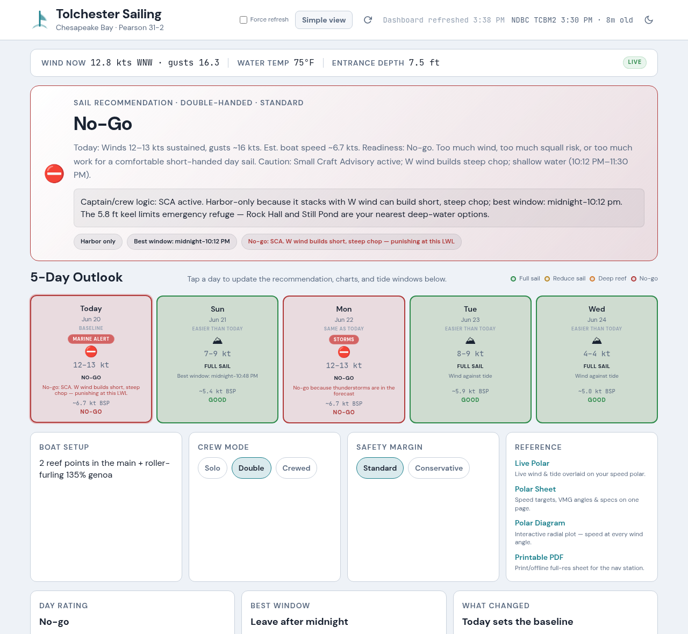

# Tolchester Sailing Dashboard

A personal, single-page sailing dashboard for a **Pearson 31-2** sailing the
upper **Chesapeake Bay** out of Tolchester Beach, MD. It pulls live wind, tide,
current, weather, and notice-to-mariners data from public NOAA / NWS / EPA /
USCG feeds and turns it into an at-a-glance go / reduce-sail / no-go
recommendation tuned to the boat's polars and the skipper's crew/safety mode.

It's a static site — plain HTML, CSS, and vanilla ES-module JavaScript, no
backend and no build step — designed to be hosted on S3 + CloudFront.

**Live demo:** <https://dashboard.sailingaurora.com>



## Tech overview

- **Frontend:** vanilla JS ES modules ([`app.js`](app.js) + [`src/`](src/)),
  no framework, no bundler.
- **Data:** browser fetches directly from NOAA Tides & Currents, weather.gov
  (NWS), NDBC, EPA UV, and USCG feeds — none of it transits a backend.
- **Hosting:** private S3 bucket served via CloudFront (Origin Access Control),
  optional Route 53 + ACM custom domain.
- **Deploy:** GitHub Actions assumes an AWS IAM role via OIDC (no stored AWS
  keys); see [`infra/`](infra/) and [`architecture-diagram.md`](architecture-diagram.md).

## Want this for your boat?

This dashboard is built for one specific boat and one stretch of water. If you
want a hosted version that works with **any boat on any stretch of the
Chesapeake**, [**MySailingPlan.com**](https://mysailingplan.com) offers a
paid-tier dashboard with features that go beyond what a static single-boat page
can provide:

- **Sailability scoring** — a 0–100 composite (speed + comfort + weather) so
  you get one number instead of a stack of raw values to interpret
- **Departure window optimizer** — scans the next 7 days of NOAA forecasts and
  ranks leave times by your boat's polar, keel draft, and preferred wind angles
- **Current-opposition alerts** — flags when wind and tidal current are setting
  up opposing chop
- **Crew preparedness** — hypothermia risk, PFD recommendations, and wind chill
  based on current water and air temperature
- **Crew access** — invite crew with role-based permissions (captain, crew,
  viewer, and more) so your team can view the same dashboard without sharing
  your login
- **Custom polar data** — import ORC polars for your specific boat

→ [mysailingplan.com](https://mysailingplan.com)

---

## Make it your own

This dashboard is hard-tuned to one boat and one stretch of water. To adapt it,
edit [`src/config.js`](src/config.js) — it holds, in one place:

- **Location & timezone** — `DASHBOARD_LOCATION`, `DASHBOARD_TIME_ZONE`.
- **Data stations** — NOAA tide/current station IDs, the NDBC wind station,
  NWS forecast grid and marine zones, UV ZIP, etc.
- **Boat model** — the Pearson 31-2 polar table (`POLAR_*`), hull speed, keel
  draft / depth constraints, and the sail-plan wind thresholds.
- **Crew & safety modes** — wind offsets applied to the recommendation.

### Finding your station IDs

Every value in `src/config.js` that references a station ID needs to be
replaced with one that covers your sailing area:

| Config key | What it is | How to find yours |
| --- | --- | --- |
| `NOAA_STATION` | NOAA tide gauge (tides, water temp, water level) | [tidesandcurrents.noaa.gov](https://tidesandcurrents.noaa.gov/) → find your nearest station → copy the 7-digit ID |
| `TCBM2_STATION_ID` | NDBC meteorological buoy or C-MAN station (live wind) | [ndbc.noaa.gov/obs.shtml](https://www.ndbc.noaa.gov/obs.shtml) → find the nearest active station → copy the ID |
| `NOAA_CURRENT_STATION` | NOAA tidal current prediction station | [tidesandcurrents.noaa.gov/currents/](https://tidesandcurrents.noaa.gov/currents/) → pick the channel nearest your route |
| `WEATHER_GRID` | NWS forecast grid point | `curl "https://api.weather.gov/points/{lat},{lon}"` → read `gridId`, `gridX`, `gridY` from the response |
| `MARINE_ALERT_ZONES` | NWS marine alert zones | [weather.gov/lmk/zones](https://www.weather.gov/gis/MarineZones) or `https://api.weather.gov/alerts/active?area={state}` |
| `UV_ZIP` | ZIP code for EPA UV forecast | Any ZIP near your sailing area |
| `BAY_BUOY_STATION` | CBIBS buoy (optional) | [buoybay.noaa.gov](https://buoybay.noaa.gov/) — Chesapeake Bay only; leave blank if outside the Bay |

Also update `DASHBOARD_LOCATION` (lat/lon of your marina), `DASHBOARD_TIME_ZONE`
(IANA tz string, e.g. `"America/Chicago"`), and the `POLAR_*` table and
`KEEL_DRAFT_FT` / `CHARTED_DEPTH_MLLW` to match your boat.

### CBIBS API key

CBIBS buoys cover the Chesapeake Bay only. `src/config.js` ships with
`CBIBS_API_KEY = ""` — if you sail the Bay, request a free key and paste it
here: <https://buoybay.noaa.gov/data/api>. The key is necessarily visible in
client-side code; it grants no access to this project's infrastructure.
If you're outside the Bay, leave the key blank and set `BAY_BUOY_STATION` to
use an NDBC station instead.

## Develop & test

```bash
npm install        # dev deps only (eslint, jsdom)
npm test           # run the test suite (tests.mjs)
npm run test:live  # run tests against live APIs (LIVE_API=1)
npm run lint       # eslint
```

There's no dev server — open `index.html` in a browser, or serve the directory
with any static file server.

## Deploy your own copy

The whole AWS footprint is Terraform in [`infra/`](infra/). In short:

1. `cp infra/terraform.tfvars.example infra/terraform.tfvars` and fill in your
   own `domain_name`, `route53_zone_id`, region, etc. (`terraform.tfvars` is
   gitignored — keep your real values out of version control).
2. `cd infra && terraform init && terraform apply`.
3. Run [`deploy.sh`](deploy.sh) locally, or set up the optional GitHub Actions
   automation described in [`docs/AUTOMATION.md`](docs/AUTOMATION.md).

See [`infra/README.md`](infra/README.md) for the full walkthrough.

> **Note:** this public repo ships **no GitHub Actions workflows**, so nothing
> deploys or runs automatically when you fork it. The deploy and chart-cache
> automation are provided as copy-paste templates in
> [`docs/AUTOMATION.md`](docs/AUTOMATION.md) — add them to your own fork if you
> want push-to-deploy.

## License

[MIT](LICENSE) © rikt46
