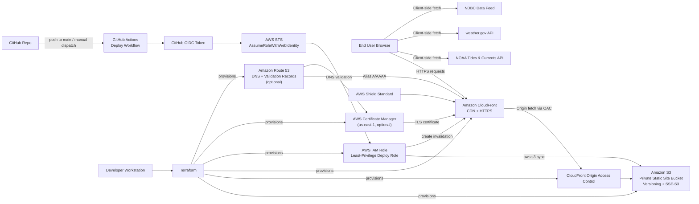

# Sailing Dashboard Architecture

## Notes

- Static site files are hosted in Amazon S3 and served publicly only through Amazon CloudFront using Origin Access Control.
- The custom domain path is optional; when enabled, Route 53 aliases the domain to CloudFront and ACM provides the certificate in `us-east-1`.
- GitHub Actions deploys by assuming an AWS IAM role through GitHub OIDC and AWS STS, avoiding stored long-lived AWS keys.
- The browser fetches live sailing data directly from NOAA, NWS, and NDBC APIs; those data calls do not transit AWS infrastructure.
